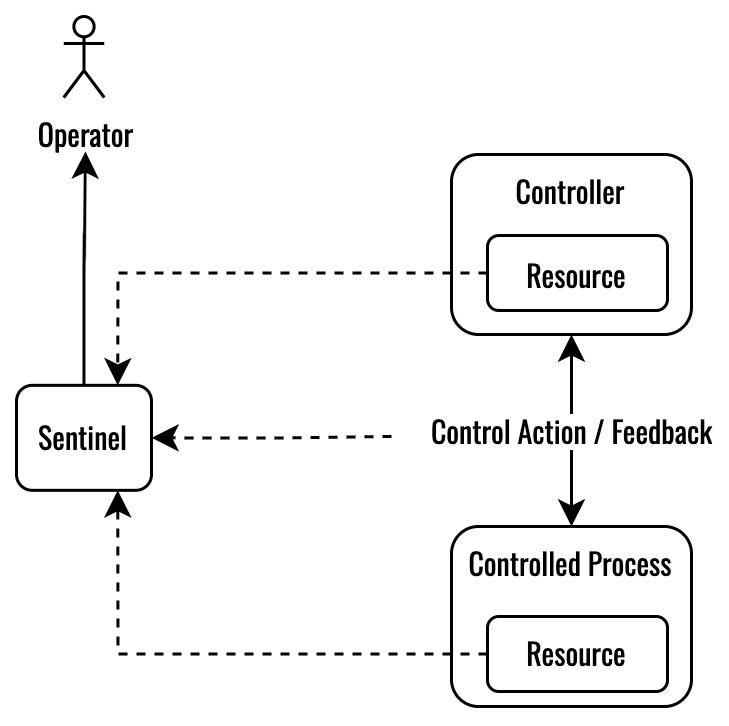
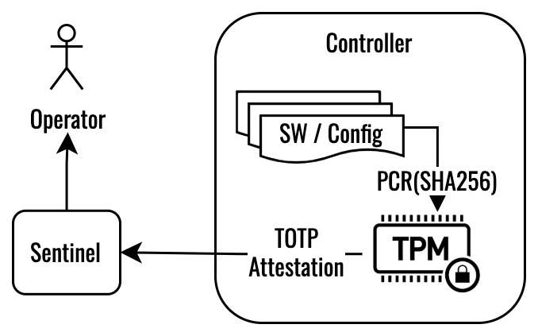

# Monitor Patterns

## [Control Path Consistency](control-path.sysml)

A Sentinel monitors control action consistency when a system involves a hierarchy of controllers.

## [Resource Introspection](res-introspection.sysml)

A Sentinel monitors controller / controlled process resource utilization (cpu, memory, link, etc.) to ensure consistency with current operating state / mode of the system.

## [TPM for TOTP Attestation](tpm-attestation.sysml)

During controller boot, secure hashes (SHA256) of partitions of software and configuration are performed and extended to platform configuration registers (PCR) of a trusted platform module (TPM) . Typically, the firmware which performs the initial partition hash is from a write-once memory location. Upon completion of the boot sequence, if all PCR values hold correct SHA256 values a shared secret is released within the TPM that allows calculation of  a time-based one-time-password (TOTP). The TOTP is reported to the Sentinel which attests (via prior  knowledge of the controller shared secret) that all partitions of controller software and configuration have not been tampered.