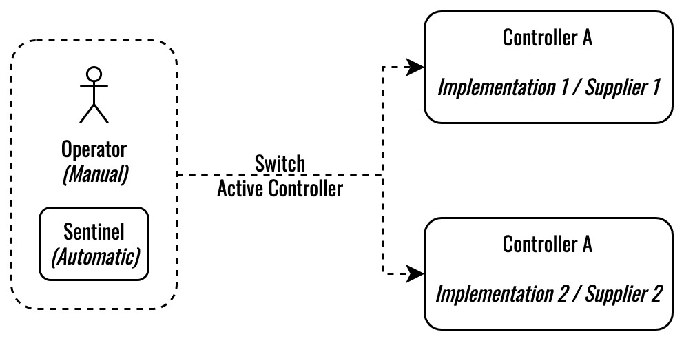
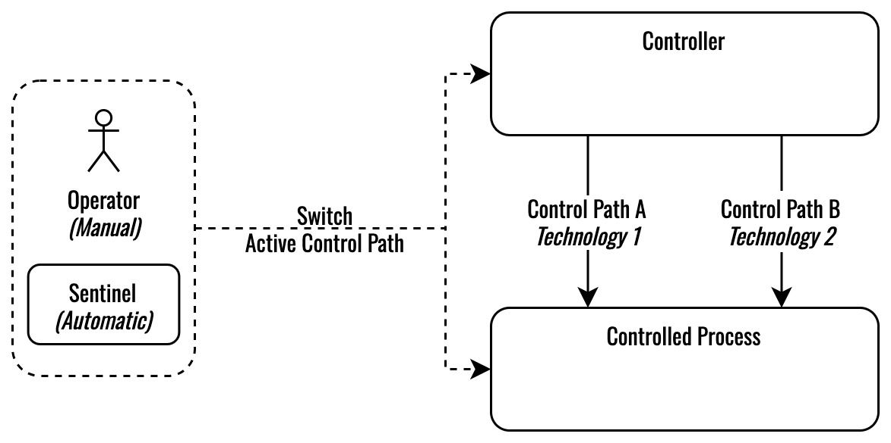
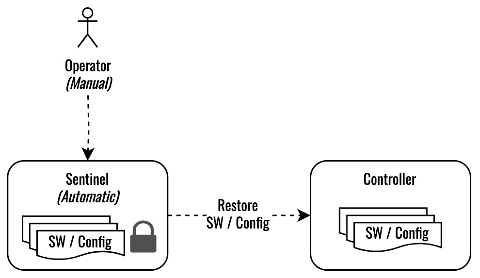

# Resilence Patterns

## [Diverse Redundant Controller](div-red-part.sysml)

Depending on mission requirements, the sentinel may automatically initiate the switch of the active controller, or the operator may manually initiate the switch. The diversity of implementation / supplier makes it unlikely that detected abnormal system behavior will be propagated to the redundant controller. 

## [Diverse Redundant Path](div-red-con.sysml)

Depending on mission requirements, the sentinel may automatically initiate the switch of the active path, or the operator may manually initiate the switch. The diversity of the path technology makes it unlikely that the detected abnormal system behavior will be propagated to the redundant path.

## [Protected Restore](prot-restore.sysml)

Depending on mission requirements, the sentinel may automatically initiate the restore of software / configuration for a controller, or the operator may manually initiate the restore. The restore of a protected backup can interrupt a cyber attacker's access into a controller and restore a controller to a known state of operation.
